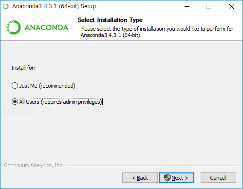

# Preparations for this course
1회차때 발표 자료 중 **`개발환경 구성`** 참고

## Anaconda 설치 !
* [공식홈페이지](https://docs.continuum.io/anaconda/install)

### **기존에 CPython이 설치가 되어 있다면??**
- CPython을 지우고 Anaconda 설치.
- CPython을 지우지 않고 설치할 경우 환경변수를 잘 세팅해서 Anaconda가 먼저 실행되도록 설정.

    * [Windows 에서 환경변수 적용 순서](https://stackoverflow.com/questions/4477660/what-is-the-difference-between-user-variables-and-system-variables)

        1. System variables
        2. Variables defined in autoexec.bat
        3. User variables

    * Anaconda 설치시 All Users로 선택하게 되면 system variables로 path가 설정됨
    


### [**프로그램의 설치경로 확인하기**](https://stackoverflow.com/questions/4002819/finding-the-path-of-the-program-that-will-execute-from-the-command-line-in-window)

Windows CMD
```cmd
C:\> where notepad
C:\Windows\System32\notepad.exe
C:\Windows\notepad.exe
```

Bash shell
```sh
kisuya@Kisuya_laptop:/usr/bin$ which pip
/usr/bin/pip
```


## Git, Github
- [Git 설치](https://git-scm.com/book/ko/v2/%EC%8B%9C%EC%9E%91%ED%95%98%EA%B8%B0-Git-%EC%84%A4%EC%B9%98)
- [Github 가입](https://github.com/)


## VS Code 설치
- [공식 홈페이지 - Python on Visual Studio Code](https://code.visualstudio.com/docs/languages/python)